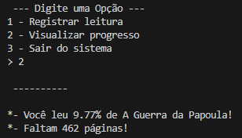

# Programa: Controle de Progresso de Leitura

> Programa simples feito na linguagem _Python_ que oferece funcionalidades de registro e controle sobre o progresso de leitura de um livro.
>

## Visualização Prévia

* Menu inicial:

* Uma das funcionalidades (Opção 2):

